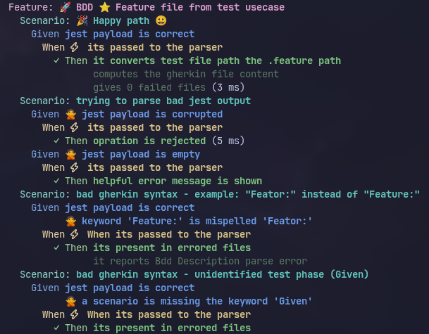
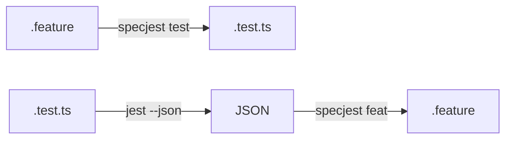

# 🧪 SpecJest

BDD helpers for Jest tests.



```
.feature ✨ <---> ✨ .test.ts
```

## 📦 Install

```bash
npm install specjest --save-dev
```

## 🔄 Integration withing your test runner



## 🎯 Use Cases

### 1. 📄 ➡️ 🧪 Feature to Test

Convert a `.feature` file into a Jest test with `test.todo()` stubs.

```bash
npx specjest test path/to/file.feature
```

**Input** (`user.feature`):
```gherkin
Feature: Create User

  Scenario: Valid user
    Given a new user
    When data is submitted
    Then user is saved
```

**Output** (`user.test.ts`):
```typescript
describe(`Feature: Create User`, () => {
  describe(`Scenario: Valid user`, () => {
    describe(`Given a new user`, () => {
      describe(`When data is submitted`, () => {
        test.todo(`Then user is saved`);
      });
    });
  });
});
```

### 2. 🧪 ➡️ 📄 Test to Feature

Generate `.feature` files from existing Jest tests.

```bash
npx jest --json | npx specjest feat
```

Or for specific tests:
```bash
npx jest user.test.ts --json | npx specjest feat
```

Tests must use Gherkin prefixes: `Feature:`, `Scenario:`, `Given`, `When`, `Then`, `And`.

### 3. 🎨 BDD Test Helpers (Optional)

Add global BDD functions (`feature`, `scenario`, `given`, `when`, `then`) with colored output.


**⚡ Quick setup** - import the preset:

```typescript
// jest.setup.ts
import "specjest/bdd";
```

```javascript
// jest.config.js
module.exports = {
  setupFilesAfterEnv: ["<rootDir>/jest.setup.ts"]
};
```

That's it! 🎉 All BDD globals are now available.

---

<details>
<summary>🔧 <strong>Custom setup</strong> - configure formatting manually</summary>

**jest.setup.ts**:
```typescript
import { applyFormatting } from "specjest";

declare global {
  function feature(name: string, fn: () => void): void;
  function scenario(name: string, fn: () => void): void;
  function given(name: string, fn: () => void): void;
  function when(name: string, fn: () => void): void;
  function then(name: string, fn?: jest.ProvidesCallback, timeout?: number): void;
}

globalThis.feature = applyFormatting(describe, ({ description, color, bold }) =>
  color("magenta", `Feature: ${bold(description)}`)
);
globalThis.scenario = applyFormatting(describe, ({ description, color, bold }) =>
  color("cyan", `Scenario: ${bold(description)}`)
);
globalThis.given = applyFormatting(describe, ({ description, color, bold }) =>
  color("blue", `Given ${bold(description)}`)
);
globalThis.when = applyFormatting(describe, ({ description, color, bold }) =>
  color("yellow", `When ${bold(description)}`)
);
globalThis.then = applyFormatting(it, ({ description, color, bold }) =>
  color("green", `Then ${bold(description)}`)
);
```

**Usage**:
```typescript
feature("User Registration", () => {
  scenario("Valid input", () => {
    given("a new email", () => {
      when("form is submitted", () => {
        then("user is created", () => {
          expect(true).toBe(true);
        });
      });
    });
  });
});
```

</details>

## 📖 CLI Reference

| Command | Description |
|---------|-------------|
| `specjest test <file.feature>` | 📄 ➡️ 🧪 Convert feature to test |
| `jest --json \| specjest feat` | 🧪 ➡️ 📄 Convert tests to features |
| `specjest` | ❓ Show help |

## 🏷️ Gherkin Keywords

Recognized prefixes: `Feature:`, `Scenario:`, `Given`, `When`, `Then`, `And`

## 📜 License

MIT
